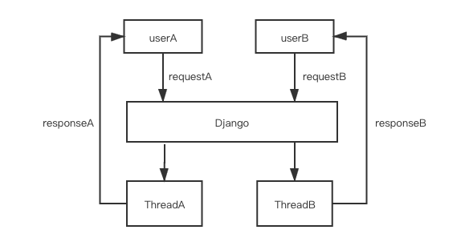
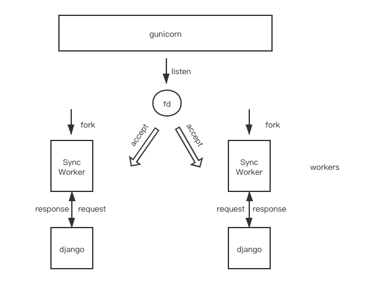

# django gunicorn gevent greenlet daphne What are they?

# Part1 django and gunicorn

If you've written Python web application, you will find a dozen of server framework and deployment components on the Internet

Or If you take over other teammate's project, though they are all Python code, you may found they use various framework and W(A)SGI lib

"Oh, it's django app, I can start it with `python manage.py runserver`, but why the deployment command is `gunicorn xxx:xxx ` instead of `python manage.py runserver`". what is the concurrency capabilities of our system? How many process and thread will the server start? Is it blocking IO or non-blocking IO ?, you start to get confused

You need to understand how it works to choose the proper framework and tune the configuration

## django

If you visit the official site of [Django](https://github.com/django/django)

> Django is a high-level Python Web framework that encourages rapid development and clean, pragmatic design.

It's easy to write application interface in django, with the `orm` support, as long as the code is manipulating the `orm` object instead of `SQL` directly, you can easily change your database engine or update your database field without modifying your business code

Suppose you're familiar with django app, type in ``python manage.py runserver`` and server started

If there comes a new request, django starts a new thread and serve the coming request by default. Whenever there comes a new request, a new thread will be created

Refer to [my blog](https://blog.csdn.net/qq_31720329/article/details/90295027?spm=1001.2014.3001.5501) If you need the detail of the whole call stack



## gunicorn

Before knowing `gunicorn`, let's see the definition [WSGI](https://en.wikipedia.org/wiki/Web_Server_Gateway_Interface)

[WSGI](https://en.wikipedia.org/wiki/Web_Server_Gateway_Interface) is defined as 

> The **Web Server Gateway Interface** (**WSGI**, pronounced *whiskey*[[1\]](https://en.wikipedia.org/wiki/Web_Server_Gateway_Interface#cite_note-1)[[2\]](https://en.wikipedia.org/wiki/Web_Server_Gateway_Interface#cite_note-2) or [*WIZ-ghee*](https://en.wikipedia.org/wiki/Help:Pronunciation_respelling_key)[[3\]](https://en.wikipedia.org/wiki/Web_Server_Gateway_Interface#cite_note-3)) is a simple [calling convention](https://en.wikipedia.org/wiki/Calling_convention) for [web servers](https://en.wikipedia.org/wiki/Web_server) to forward requests to [web applications](https://en.wikipedia.org/wiki/Web_application) or [frameworks](https://en.wikipedia.org/wiki/Web_framework) written in the [Python programming language](https://en.wikipedia.org/wiki/Python_(programming_language)). The current version of WSGI, version 1.0.1, is specified in [Python Enhancement Proposal](https://en.wikipedia.org/wiki/Python_Enhancement_Proposal) (PEP) 3333.[[4\]](https://en.wikipedia.org/wiki/Web_Server_Gateway_Interface#cite_note-:0-4)
>
> WSGI was originally specified as PEP-333 in 2003.[[5\]](https://en.wikipedia.org/wiki/Web_Server_Gateway_Interface#cite_note-5) PEP-3333, published in 2010, updates the specification for [Python 3](https://en.wikipedia.org/wiki/Python_3).

And 

[gunicorn](https://en.wikipedia.org/wiki/Gunicorn) is defined as 

> The **Gunicorn** "Green Unicorn" (pronounced jee-unicorn or gun-i-corn)[[2\]](https://en.wikipedia.org/wiki/Gunicorn#cite_note-2) is a [Python](https://en.wikipedia.org/wiki/Python_(programming_language)) [Web Server Gateway Interface](https://en.wikipedia.org/wiki/Web_Server_Gateway_Interface) (WSGI) [HTTP server](https://en.wikipedia.org/wiki/Web_server). It is a pre-[fork](https://en.wikipedia.org/wiki/Fork_(operating_system)) worker model, [ported](https://en.wikipedia.org/wiki/Porting) from [Ruby's](https://en.wikipedia.org/wiki/Ruby_(programming_language)) [Unicorn](https://en.wikipedia.org/wiki/Unicorn_(web_server)) project. The Gunicorn server is broadly compatible with a number of [web frameworks](https://en.wikipedia.org/wiki/Web_framework), simply implemented, light on server resources and fairly fast.[[3\]](https://en.wikipedia.org/wiki/Gunicorn#cite_note-3)

When you start a gunicorn program, the master process will call  `listen` to bind the specific address and port, and get a file descriptor

After that fork N(which is the `worker` number you config) process, pass down the fd(file descriptor) to every child process(worker)

Each worker will create a temporary file(something like `/var/folders/62/nzw4jhq14yzbd5722996v7s00000gn/T/wgunicorn-3ygziaw_`), and constantly update the file by calling `fchmod()`, and the master process is able to know whether the worker is alive by constantly check the update time of the temp file(by callling `fstat().st_ctime`)

The worker(child process) is able to know whether the master process is alive by checking the passed down master process id and the result of `os.getppid()` (`self.ppid != os.getppid()`), and it does constantly check

The master process will bind the address, initialize the worker(create and get the file descriptor of the temporary file, pass down the current process id as `ppid` for the child, pass down the  `listen` file descriptor, ...etc), and then call `fork` , after `fork`, the `os` guarantee that the `fd` created by parent process can still be used by child, so that the master is able to manage the workers by the aforementioned mechanism

Each worker will call it's `run` method and loop in an infinitely loop


The default worker is `SyncWorker`, in each loop, `SyncWorker` will call `accept` to get a client request, and handle the request

```python3
# gunicorn/workers/sync.py
while self.alive:
    # constantly update the temporary file
    self.notify()

    # Accept a connection. If we get an error telling us
    # that no connection is waiting we fall down to the
    # select which is where we'll wait for a bit for new
    # workers to come give us some love.
    try:
        # accept and handle
        self.accept(listener)
        # Keep processing clients until no one is waiting. This
        # prevents the need to select() for every client that we
        # process.
        continue

    except EnvironmentError as e:
        if e.errno not in (errno.EAGAIN, errno.ECONNABORTED,
                           errno.EWOULDBLOCK):
            raise

    if not self.is_parent_alive():
        return
        
    try:
        # call select.select
        self.wait(timeout)
    except StopWaiting:
        return
```


And the `accept`  function for `SyncWorker` will call `self.wsgi(environ, resp.start_response)` which calls down to `WSGIHandler.__call__(self, environ, start_response)`(defined in `django/core/handlers/wsgi.py` )

Yes, that's django part, django will handle the request and return the response object to `SyncWorker`, and there are always one thread handling the request

The `accept`  function for `SyncWorker` is definded as 

```python3
# gunicorn/workers/sync.py
def accept(self, listener):
    client, addr = listener.accept()
    client.setblocking(1)
    util.close_on_exec(client)
    # calls down to WSGIHandler.__call__(self, environ, start_response)
    self.handle(listener, client, addr)
```

Let's see an example, When you type in 

```shell
django-admin startproject mysite
cd mysite
gunicorn --workers 2 mysite.wsgi
```

The master process `listen` to default `127.0.0.1:8000` and call fork to fork two process(worker) 

Each worker will load `mysite/wsgi.py` to get the `application` instance, The default `application` is imported in `from django.core.wsgi import get_wsgi_application`, it implements the `WSGI` interface, so that `gunicorn` is able to load it and serve response for every request



