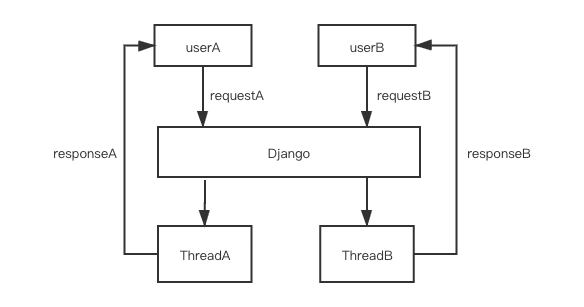
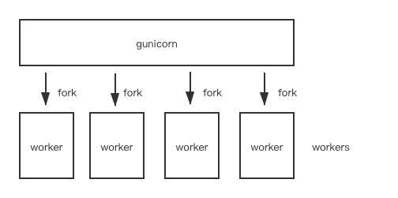
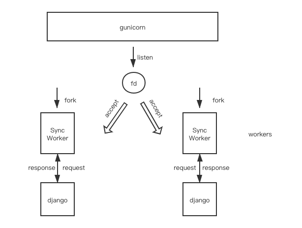

# django 和 gunicorn?

如果你进行过基于 Python 的 web 应用开发, 你会发现网络上能搜到许多不同的框架和组件

如果你接手过其他团队成员的项目, 你会发现虽然都是 Python 代码, 但是同样有各种各样的组件和 W(A)SGI 库

”喔这是 django 应用, 我用下面这行命令就可以启动了 `python manage.py runserver`", 但是为什么部署的时候启动命令是 `gunicorn xxx:xxx ` 而不是 `python manage.py runserver`, 我们系统能承受最大的并发数是多少, 服务会启动多少个进程和线程? 我的服务在运行时是阻塞式的IO还是非阻塞式的 ? 你开始皱起了眉头

我们需要了解他们的工作原理, 以便在需要的时候进行技术选型, 排障, 二次开发, 以及性能调优

## django

我们打开 [Django](https://github.com/django/django) 的官方网站

> Django 是一个更贴近应用层的 Python Web 框架, 鼓快在其之上对应用快速迭代, 和清晰实用的应用设计

在 django 中进行接口开发是比较容易上手的, 并且只要你的业务代码直接操作的是 `orm`  而不是 `SQL`, 你可以很方便的在不改动业务代码的情况下, 对数据引擎进行切换或者对修改数据库表字段

假设你对 django 应用比较熟悉了, 输入 `python manage.py runserver` 服务启动之后, 如果此时有请求进来, `django` 默认情况下会启动一个新的线程并且处理对应的请求, 每当有一个新的请求进来时, 就会有一个新的线程被创建

如果你需要整个调用栈的详情, 参考 [我的这篇博客](https://blog.csdn.net/qq_31720329/article/details/90295027?spm=1001.2014.3001.5501)



## gunicorn

在了解 `gunicorn` 之前, 我们先来看一下 [WSGI](https://en.wikipedia.org/wiki/Web_Server_Gateway_Interface) 的定义

[WSGI](https://en.wikipedia.org/wiki/Web_Server_Gateway_Interface) 的定义如下 

> **Web服务器网关接口**（**Python Web Server Gateway Interface**，缩写为WSGI）是为[Python](https://zh.wikipedia.org/wiki/Python)语言定义的[Web服务器](https://zh.wikipedia.org/wiki/網頁伺服器)和[Web应用程序](https://zh.wikipedia.org/wiki/网络应用程序)或[框架](https://zh.wikipedia.org/wiki/Web应用框架)之间的一种简单而通用的[接口](https://zh.wikipedia.org/wiki/介面_(程式設計))。自从WSGI被开发出来以后，许多其它语言中也出现了类似接口。

并且 

[gunicorn](https://en.wikipedia.org/wiki/Gunicorn) 的定义如下

> **Gunicorn** "Green Unicorn" (pronounced jee-unicorn or gun-i-corn)[[2\]](https://en.wikipedia.org/wiki/Gunicorn#cite_note-2) 是一个 [Python](https://en.wikipedia.org/wiki/Python_(programming_language)) [Web Server Gateway Interface](https://en.wikipedia.org/wiki/Web_Server_Gateway_Interface) (WSGI) [HTTP 服务](https://en.wikipedia.org/wiki/Web_server). 它是一个预先 fork 出工作 worker 的模型, 从 [Ruby's](https://en.wikipedia.org/wiki/Ruby_(programming_language)) [Unicorn](https://en.wikipedia.org/wiki/Unicorn_(web_server)) 项目移植过来. Gunicorn 服务适配许多 web 框架, 实现简单, 资源占用小并且运行速度快

当你启动一个 gunicorn 程序时, 主进程会调用 `listen` 方法对指定的地址和端口进行绑定, 并获取到文件描述符

在这之后 fork 出 N 个进程(N 就是配置文件里的 `worker` 整数值), 在 fork 之前把对应的文件描述符传递给了每个子进程(worker)

每个 worker 会创建一个临时文件 (文件名称类似 `/var/folders/62/nzw4jhq14yzbd5722996v7s00000gn/T/wgunicorn-3ygziaw_`),  并且持续地调用 `fchmod()` 更新这个文件, 主进程可以通过持续的检查这个临时文件的更新时间来知晓对应的 worker 是否还存活着(通过 `fstat().st_ctime` 获取更新时间)

worker(子进程) 可以通过持续的检查传入的主进程id和 `os.getppid()` (`self.ppid != os.getppid()`) 的值, 来判断主进程是否还存活着

主进程绑定了服务地址后, 初始化worker(创建并获取临时文件描述符, 传入当前的进程id作为子进程的`ppid`, 传入当前绑定了地址的文件描述符等操作), 之后进行 `fork` 系统调用, 在 `fork`之后, 操作系统会保证主进程创建的文件描述符在子进程中依旧可以使用, 这样主进程就可以通过上述机制对子进程进行管理

每个 worker 会调用自身 `run` 方法并进入一个无限循环中



默认的 worker 是 `SyncWorker`, 在每一次循环中, `SyncWorker` 会调用 `accept`  方法获取一个客户端发送过来的请求, 并且处理对应的请求

```python3
# gunicorn/workers/sync.py
while self.alive:
    # 持续地对临时文件进行更新
    self.notify()

    # 获取一个客户端连接, 如果这里抛出了异常表明当前没有等待进行连接的请求
    # 则进入下面的 select 中, select 会阻塞直到有能建立连接的请求进来为止再进行返回
    try:
        # 获取一个连接并处理
        self.accept(listener)
        # 持续的处理客户端请求, 直到没有等待建立连接的客户端请求为止
        # 这样可以防止针对每个客户端请求都进行一次 select() 调用
        continue

    except EnvironmentError as e:
        if e.errno not in (errno.EAGAIN, errno.ECONNABORTED,
                           errno.EWOULDBLOCK):
            raise

    if not self.is_parent_alive():
        return
        
    try:
        # 调用 select.select
        self.wait(timeout)
    except StopWaiting:
        return
```


并且 `SyncWorker `的 `accept`  方法会调用 `self.wsgi(environ, resp.start_response)` , 这个方法会最终调用到`WSGIHandler.__call__(self, environ, start_response)`(文件位置 `django/core/handlers/wsgi.py` )

到这里就是 django 的部分了, django 会处理对应的请求, 并把返回内容传递给 `SyncWorker` 实例, 这里每个worker只有一个线程在处理请求

`SyncWorker`  的 `accept` 方法定义如下

```python3
# gunicorn/workers/sync.py
def accept(self, listener):
    client, addr = listener.accept()
    client.setblocking(1)
    util.close_on_exec(client)
    # 这里会最后调用到 WSGIHandler.__call__(self, environ, start_response)
    self.handle(listener, client, addr)
```

我们来看一个示例, 当你输入如下命令时

```shell
django-admin startproject mysite
cd mysite
gunicorn --workers 2 mysite.wsgi
```

主进程调用 `listen` 方法绑定了默认的地址和端口 `127.0.0.1:8000` , 之后通过系统调用 `fork` 生成两个 worker(子进程)

每一个 worker 都会加载 `mysite/wsgi.py` 并寻找名为 `application` 的实例, `django` 默认创建好的实例是从这个位置进行导入生成的  `from django.core.wsgi import get_wsgi_application`, 它实现了 `WSGI` 接口, 所以  `gunicorn` 可以对它进行加载并调用对应的方法处理每一个请求



