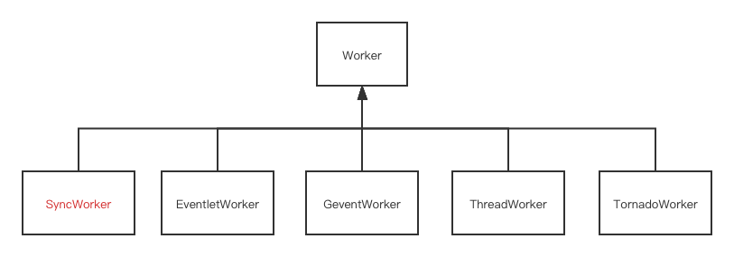
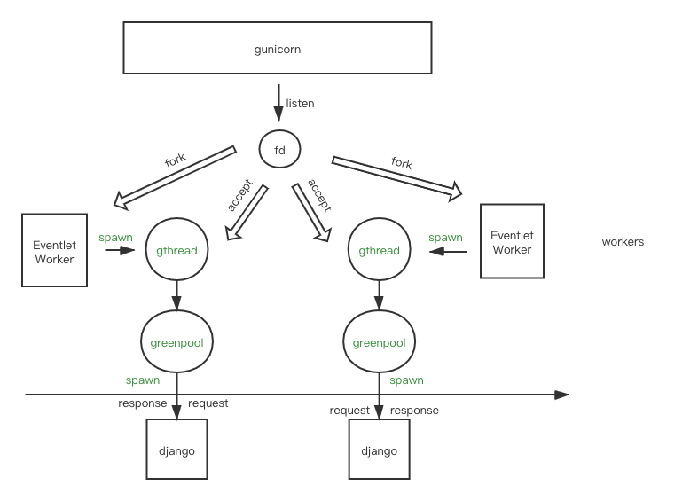
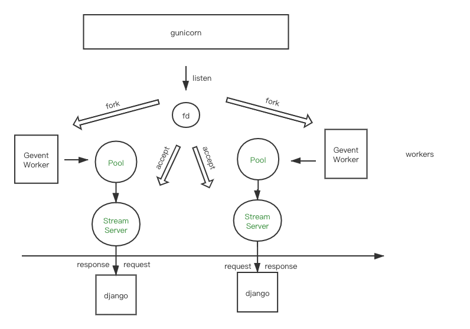

# django gunicorn gevent greenlet daphne What are they? 

# Part2 gunicorn workers

We've learned `SyncWorker` for gunicorn in part1, now let's see how other workers work



# contents

* [eventlet](#Eventlet)
* [gevent](#Gevent)
* [thread](#thread)

* [tornado](#tornado)

## Eventlet

If you visite the official site of [eventlet](https://eventlet.net/)

> Eventlet is a concurrent networking library for Python that allows you to change how you run your code, not how you write it.
>
> - It uses epoll or kqueue or libevent for [highly scalable non-blocking I/O](http://en.wikipedia.org/wiki/Asynchronous_I/O#Select.28.2Fpoll.29_loops).
> - [Coroutines](http://en.wikipedia.org/wiki/Coroutine) ensure that the developer uses a blocking style of programming that is similar to threading, but provide the benefits of non-blocking I/O.
> - The event dispatch is implicit, which means you can easily use Eventlet from the Python interpreter, or as a small part of a larger application.

`EventletWorker` inherit from `AsyncWorker`, it override the `init_process` method and `run` method

```python3
def patch(self):
    hubs.use_hub()
    eventlet.monkey_patch()
    patch_sendfile()

def init_process(self):
    self.patch()
    super().init_process()
```

After `fork` from the master process, the `init_process` calls `eventlet.monkey_patch()`  , which replace the following modules by the corresponding `eventlet` support module by default

```python3
for name, modules_function in [
    ('os', _green_os_modules),
    ('select', _green_select_modules),
    ('socket', _green_socket_modules),
    ('thread', _green_thread_modules),
    ('time', _green_time_modules),
    ('MySQLdb', _green_MySQLdb),
    ('builtins', _green_builtins),
    ('subprocess', _green_subprocess_modules),
]
```

Eventlet replaced to default IO module by it's `green` module, when you calls the `socket` function, you are actually calling `_green_socket_modules`  , which implements nonblocking IO

On every `socket` read/write, or `time.sleep`, it actually save the current context and add the current gthread to the pooling list, and then calls pool to wait for next ready IO event

It's like the `async` keyword in python3, but with less code invasion


If you run your app in eventlet mode

```python3
gunicorn --workers 2 --worker-class eventlet mysite.wsgi
```



`EventletWorker` will spawn a new `gthread`, which in charge of accept connection from socket, after accept a new connection from socket, the `gthread` pass the django handle function to the `greenpool`, and use the `greenpool` to start the django function

Thanks for `eventlet`, we can simply change `--worker-class` to make our django application blocking IO to nonblocking 

IO

Compare to define `async` function directly, your code can run both in blocking and nonblocking mode, and easier to debug

But defining `async` function with `async` keyword directly, require you to design your code in `async` style from the top down, gives you more power about `async` control. For example, `eventlet` with django parallel two different request, while `async` function is able to parallel different IO operation in the same request

## Gevent

If you visite the official site of [gevent](http://www.gevent.org/)

> gevent is a [coroutine](https://en.wikipedia.org/wiki/Coroutine) -based [Python](http://python.org/) networking library that uses [greenlet](https://greenlet.readthedocs.io/) to provide a high-level synchronous API on top of the [libev](http://software.schmorp.de/pkg/libev.html) or [libuv](http://libuv.org/) event loop.
>
> gevent is [inspired by eventlet](http://blog.gevent.org/2010/02/27/why-gevent/) but features a more consistent API, simpler implementation and better performance. 

The differences

> 1. gevent is built on top of libevent(since 1.0, gevent uses libev and c-ares.)
>    * Signal handling is integrated with the event loop.
>    * Other libevent-based libraries can integrate with your app through single event loop.
>    * DNS requests are resolved asynchronously rather than via a threadpool of blocking calls.
>    * WSGI server is based on the libevent’s built-in HTTP server, making it [super fast](http://nichol.as/benchmark-of-python-web-servers).
> 2. gevent’s interface follows the conventions set by the standard library
> 3. gevent does not have all the features that Eventlet has.

If you had another library (written in C) that used libevent’s event loop and want to integrate them together in a single process, gevent support while eventlet does not

Let's go back to `gunicorn`

`GeventWorker` inherit from `AsyncWorker`, it also override the `init_process` method and `run` method

```python3
def patch(self):
    monkey.patch_all()

def init_process(self):
    self.patch()
    hub.reinit()
    super().init_process()
```

After `fork` from the master process, the `init_process` calls `gevent.monkey()`  , which replace the following modules by the corresponding `gevent` support module

```python3
def patch_all(socket=True, dns=True, time=True, select=True, thread=True, os=True, ssl=True,
              subprocess=True, sys=False, aggressive=True, Event=True,
              builtins=True, signal=True,
              queue=True, contextvars=True,
              **kwargs):
              pass

```

The pattern is similar to [eventlet](#Eventlet), the interface is different, so the actual function being called in `run` is slightly different

```python3
# gunicorn/workers/ggevent.py
from gevent.pool import Pool
from gevent.server import StreamServer

def run(self):
	# ...
	pool = Pool(self.worker_connections)
	# ...
	server = StreamServer(s, handle=hfun, spawn=pool, **ssl_args)
	# ...
	server.start()
```

If you run

```bash
gunicorn --workers 2 --worker-class eventlet mysite.wsgi
```



The pros and cons of using `gevent` is the same as `eventlet`, we are not repeating it again

If you focus more on performance, or you've  C lib that use libevent’s(or libev) event loop that want to integrate into Python in a single process, consider using `gevent`

If you rely on some specific features on `eventlet` such as `eventlet.db_pool` or `eventlet.processes`, you probably should keep using `eventlet`

## thread

By default `gunicorn` use the `sync` [mode](https://github.com/zpoint/Blog/blob/master/Python/django/django.md), It prefork `workers` number of process and each worker is able to handle one request at a time

`ThreadWorker` inherit from `Worker`, it also override the `init_process` method and `run` method

```python3
def init_process(self):
    self.tpool = self.get_thread_pool()
    self.poller = selectors.DefaultSelector()
    self._lock = RLock()
    super().init_process()

def enqueue_req(self, conn):
    conn.init()
    # submit the connection to a worker
    fs = self.tpool.submit(self.handle, conn)
    self._wrap_future(fs, conn)

def accept(self, server, listener):
    try:
        sock, client = listener.accept()
        # initialize the connection object
        conn = TConn(self.cfg, sock, client, server)
        self.nr_conns += 1
        # enqueue the job
        self.enqueue_req(conn)
    except EnvironmentError as e:
        if e.errno not in (errno.EAGAIN, errno.ECONNABORTED,
                           errno.EWOULDBLOCK):
            raise
            
def run(self):
    # ....
```

We can see that `init_process` create a thread pool, and `accept` just push the established connection to the `queue` inside the `ThreadPool` object

> 1. If there is a concern about the application [memory footprint](https://en.wikipedia.org/wiki/Memory_footprint), using `threads` and its corresponding **gthread worker class** in favor of `workers` yields better performance because the application is loaded once per worker and every thread running on the worker shares some memory, this comes to the expense of some additional CPU consumption.

Let's see an example

```bash
gunicorn --workers 1 --worker-class gthread --threads 2 mysite.wsgi
```

The `--threads` will only affect `gthread` worker class, other worker class will not be affected by `--threads` parameter


## read more

* [what are you using gevent for?](#https://groups.google.com/g/gevent/c/TelwPl3KgnE)
* [Comparing gevent to eventlet](https://blog.gevent.org/2010/02/27/why-gevent/)
* [Better performance by optimizing Gunicorn config](https://medium.com/building-the-system/gunicorn-3-means-of-concurrency-efbb547674b7)

