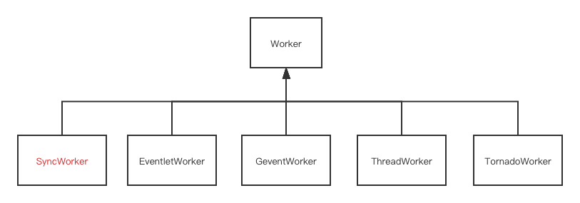

# gunicorn workers

我们在 [第一篇](https://github.com/zpoint/Blog/blob/master/Python/django/django_cn.md) 里已经了解过 gunicorn 的 `SyncWorker` 原理, 现在我们来看下其他的 workers 是如何工作的



# 目录

* [eventlet](#Eventlet)
* [gevent](#Gevent)
* [thread](#thread)
* [tornado](#tornado)
* [更多资料](#更多资料)

## Eventlet

如果你打开 [eventlet](https://eventlet.net/) 的官网

> Eventlet 是一个 Python 网络库, 支持并发访问, 使用这个库可以在不改变代码写法的情况下更改代码的运行方式
>
> * 它使用了 epoll/kqueue/libevent , 这样可以支持 [可扩展的非阻塞式 I/O](http://en.wikipedia.org/wiki/Asynchronous_I/O#Select.28.2Fpoll.29_loops)
> * [协程](http://en.wikipedia.org/wiki/Coroutine)  的支持可以让开发者像使用线程一样编写顺序性代码, 但是运行时又提供了非阻塞IO的运行方式
> * 对于事件的派发/回调是集成在库中的, 开发者不需要关注这部分逻辑, 所以你可以很方便地在 Python 解释器中使用 Eventlet, 或者在一个大型应用的一个模块中使用

`EventletWorker` 继承自 `AsyncWorker`, 它覆写了 `init_process` 方法和 `run` 方法

```python3
def patch(self):
    hubs.use_hub()
    eventlet.monkey_patch()
    patch_sendfile()

def init_process(self):
    self.patch()
    super().init_process()
```

在从主进程 `fork` 之后, `init_process` 方法会调用 `eventlet.monkey_patch()`  , 这个方法会默认把下面的模块替换成 `eventlet` 提供的对应的模块

```python3
for name, modules_function in [
    ('os', _green_os_modules),
    ('select', _green_select_modules),
    ('socket', _green_socket_modules),
    ('thread', _green_thread_modules),
    ('time', _green_time_modules),
    ('MySQLdb', _green_MySQLdb),
    ('builtins', _green_builtins),
    ('subprocess', _green_subprocess_modules),
]
```

Eventlet 把默认的 IO 模块替换成自己的模块, 当你调用 `socket` 方法时, 你实际上调用的是实现了非阻塞式IO的`_green_socket_modules`模块中的方法

对于每一个 `socket` 的读写操作, 或者 `time.sleep` 操作, 实际上 `eventlet` 把当前的上下文保存起来, 并把当前的 `gthread` 加到等待列表种, 之后调用 pool 去等待下一个可读/可写的 IO 事件 

整体的调用流程和 python3 中的 `async` 方法类似, 但是这种方式几乎没有代码入侵


如果你用 `eventlet` 模式运行你的应用

```python3
gunicorn --workers 2 --worker-class eventlet mysite.wsgi
```


`EventletWorker` 会生成一个新的 `gthread`, 新生成的 `gthread` 负责从监听的描述符中接收新的 socket, 在接收到一个新的 socket 之后, `gthread` 会把 socket 对象和 django 处理函数一起传给 `greenpool`, `greenpool` 负责调用对应的 django 函数

在 `eventlet` 的帮助下, 我们简单的更改 `--worker-class` 就可以让我们的 django 应用从阻塞式 IO 模式变成 非阻塞式 IO 模式

比起直接定义 `async` 函数, 用 `eventlet` 的好处是你的代码可以以阻塞式的模式启动, 也可以以非阻塞式的模式启动, 调试起来更佳方便

直接定义 `async` 函数, 需要从头到尾以 `async` 的方式去设计你的代码, 你可以进行更细粒度的异步控制, 打个比方, `eventlet` 可以控制两个不同的 django 请求并发执行, 而 `async` 函数可以在同一个 django 请求中, 并发执行多个 IO 操作

## Gevent

如果你访问 [gevent](http://www.gevent.org/) 的官网

> gevent 是一个基于  [协程](https://en.wikipedia.org/wiki/Coroutine)  的 Python 网络库, 它通过  [greenlet](https://greenlet.readthedocs.io/) 提供高级的同步调用方法, 底层是通过  [libev](http://software.schmorp.de/pkg/libev.html) 或 [libuv](http://libuv.org/) 的事件循环来实现的
>
> gevent 的 [灵感来源于 eventlet](http://blog.gevent.org/2010/02/27/why-gevent/), 但是提供更加一致性的 API, 更简单的实现以及更好的性能
>
> 他们的区别有这些
>
> 1. gevent 底层基于 libevent(1.0 版本之后, gevent 基础基于 libev 和 c-ares.)
>    * 信号处理和事件循环(event loop) 绑定
>    * 其它基于 libevent 编写的库可以和你的应用通过同个事件循环(event loop)进行绑定
>    * DNS 查询是通过原生异步调用完成, 而不是开启一个线程池之通过阻塞式调用完成
>    * WSGI 服务是通过 libevent 的内置 HTTP 服务搭建, 速度 [非常快](http://nichol.as/benchmark-of-python-web-servers).
> 2. gevent 的接口和标准库的常用接口保持一致
> 3. Eventlet 提供的有些功能 gevent 不包含

如果你有其他的库(用C编写)用到了 libevent 的事件循环(event loop) 并且想要把它和你的Python程序集成在同个进程中, gevent 支持但是 eventlet 不支持

让我们回到 `gunicorn`

`GeventWorker` 继承自 `AsyncWorker`, 它也覆写了 `init_process` 方法和 `run` 方法

```python3
def patch(self):
    monkey.patch_all()

def init_process(self):
    self.patch()
    hub.reinit()
    super().init_process()
```

从主进程 `fork` 出子进程之后, 子进程调用`init_process` , 间接调用了 `gevent.monkey()` ,这个方法把下面的模块替换成对应的 `gevent` 支持的模块

```python3
def patch_all(socket=True, dns=True, time=True, select=True, thread=True, os=True, ssl=True,
              subprocess=True, sys=False, aggressive=True, Event=True,
              builtins=True, signal=True,
              queue=True, contextvars=True,
              **kwargs):
              pass

```

整个调用模式和 [eventlet](#Eventlet) 的模式相似, 但是由于底层库提供的接口是不相同的, 在 `run` 函数中进行调用的函数也会有一些区别

```python3
# gunicorn/workers/ggevent.py
from gevent.pool import Pool
from gevent.server import StreamServer

def run(self):
	# ...
	pool = Pool(self.worker_connections)
	# ...
	server = StreamServer(s, handle=hfun, spawn=pool, **ssl_args)
	# ...
	server.start()
```

如果你运行

```bash
gunicorn --workers 2 --worker-class eventlet mysite.wsgi
```


使用 `gevent` 的优缺点和使用  `eventlet` 的优缺点基本相同, 我们不在这里重复了

如果你更关注的是性能, 或者你有一个外部库(C 库)使用的是 libevent(或libev) 的事件循环, 并且你想在Python中同一个进程内使用同个事件循环, 你可以选择 `gevent`

如果你需要一些 `eventlet`  才具有的特定的功能, 比如 `eventlet.db_pool` / `eventlet.processes`, 你可以选择使用 `eventlet` 

## thread

默认情况下 `gunicorn` 使用的是 `sync` 的 [模式](https://github.com/zpoint/Blog/blob/master/Python/django/django_cn.md),, 它预先 fork `workers` 个进程, 每个进程同一时刻只能处理一个请求

`ThreadWorker` 继承自 `Worker`, 它也覆写了 `init_process` 方法和 `run` 方法

```python3
def init_process(self):
    self.tpool = self.get_thread_pool()
    self.poller = selectors.DefaultSelector()
    self._lock = RLock()
    super().init_process()

def enqueue_req(self, conn):
    conn.init()
    # submit the connection to a worker
    fs = self.tpool.submit(self.handle, conn)
    self._wrap_future(fs, conn)

def accept(self, server, listener):
    try:
        sock, client = listener.accept()
        # initialize the connection object
        conn = TConn(self.cfg, sock, client, server)
        self.nr_conns += 1
        # enqueue the job
        self.enqueue_req(conn)
    except EnvironmentError as e:
        if e.errno not in (errno.EAGAIN, errno.ECONNABORTED,
                           errno.EWOULDBLOCK):
            raise
            
def run(self):
    # ....
```

我们可以看到 `init_process` 创建了一个线程池, `accept` 只是把新接收到的连接放到 `ThreadPool` 的队列中就结束了

> 1. 如果你的应用对[内存覆盖区](https://en.wikipedia.org/wiki/Memory_footprint)有需求, 用 `threads` 模式(**gthread worker class**)而不是其他的模式能获得更好的性能, 因为每个 worker 都预先加载了你的应用, worker 中的不同线程共享相同的内存空间, 这里的代价就是会有额外的 CPU 消耗

我们来看一个示例

```bash
gunicorn --workers 1 --worker-class gevent --threads 2 mysite.wsgi
```

这个 `--threads` 参数只会影响到 `gthread` worker class, 其他的 worker 是不受这个参数影响的


每一个 worker 都会初始化一个大小为  `--threads` 的线程池 (`ThreadPool`), 每当主线程接收到一个 socket 对象时, 这个 socket 被推倒队列中, 之后`ThreadPool` 中的线程会从队列中取出对应的 socket, 并从 socket 接收信息并调用 django 应用中的对应的接口函数

## tornado

最后一个 worker class 是 `tornado`, 代码比较简洁

```python3
# gunicorn/gunicorn/workers/gtornado.py
def init_process(self):
    # IOLoop 在 fork 之后就不能使用了
    # 开启多进程的情况下, 每个进程都应该有自己的 IOLoop
    # 如果在 fork 之前就存在了 IOLoop, 我们应该清理掉它
    IOLoop.clear_current()
    super().init_process()
    
def run(self):
    # ...
```

 `run` 方法初始化了 `gunicorn` 所需的一些监控函数 , 并启动了一个 tornado 服务实例, 把之前监听的端口绑定到新启动的 tornado 实例中, 之后就启动事件循环 (`IOLoop`)

## 更多资料

* [what are you using gevent for?](#https://groups.google.com/g/gevent/c/TelwPl3KgnE)
* [Comparing gevent to eventlet](https://blog.gevent.org/2010/02/27/why-gevent/)
* [Better performance by optimizing Gunicorn config](https://medium.com/building-the-system/gunicorn-3-means-of-concurrency-efbb547674b7)

